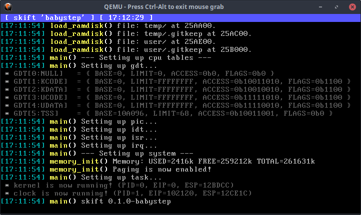

<p align="center">
    
</p>

<h1 align="center">skiftOS</h1>

**skiftOS** is a simple, handmade, build from scratch, 32bit operating system for intel x86 CPU.

**skiftOS** support virtual memory, multi processing with threads, and filesystem.

**skiftOS** provide a rich syscall interface for user application.

## What **skiftOS** look like



## Build-it

```sh
# Build the operating system
./SOSBS.py build-all

# Run it in qemu
./SOSBS.py run
```