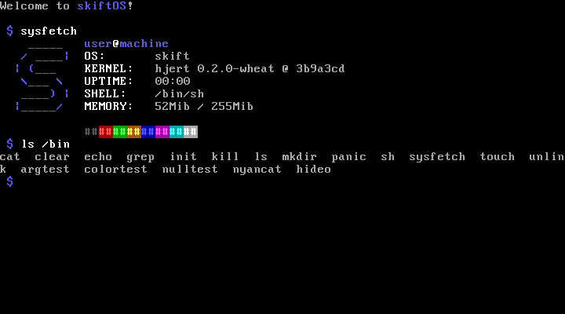

 
 

 
 
A simple, handmade, operating system for intel x86 cpu.
 
 
<a href="https://discord.gg/gamGsfg">Discord</a> -
<a href="https://skiftOS.github.io/">Website</a> -
<a href="https://github.com/skiftOS/skift/release">Releases</a> -
<a href="manual/readme.md">Manual</a>
 
 

# About skiftOS

 
skiftOS 0.2.0 running on QEMU 3.0.0

skiftOS is a simple, handmade, operating system for intel x86 cpu. Haiming for clean and elegant API while keeping the sprite of UNIX.

# Disclaimers

- **SkiftOS is a student project, don't expect it to be secure or stable at this stage.**
  
# Getting started

Folow the build guide if you whant to build skiftOS from source

- [Manual](manual/readme.md)
- [Building](manual/building.md)

# Getting involved

We welcome all contributions, just pick a task in the todo list and open an pullrequest to let us know you are working on that.

# Cool pieces

Some skiftOS's pieces can usefull for your own projects see:
 - [list.c](https://github.com/skiftOS/skift/blob/master/packages/skift.karm/core/sources/skift/list.c) and [list.h](https://github.com/skiftOS/skift/blob/master/packages/skift.karm/core/includes/skift/list.h) : a double linked list implementation
 - [vtconsole](https://github.com/skiftOS/vtconsole): an ansi escape sequence parser and renderer

# License
The skift operating and its core components are licensed under the **MIT License**.              
See: [LICENSE.md](LICENSE.md)

# Acknowledgements
- [build-ggc.sh](https://gitlab.com/toaruos/toaruos/blob/master/util/build-gcc.sh) from toaruOS

 
 
 

<i>I needed a hobby so I started building an operating system 😄</i>

