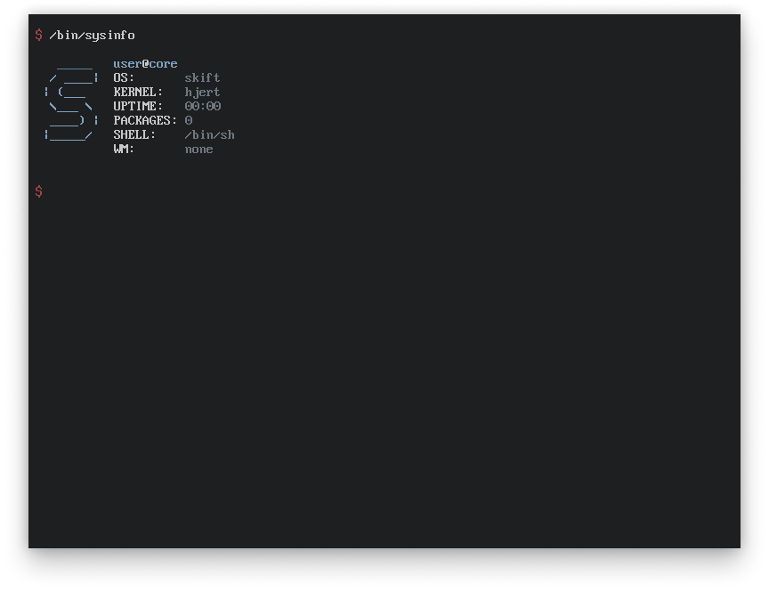

<b>See the <a href="https://github.com/skiftOS/skift/tree/develop">develop branch</a> for the lastest development</b>

A simple, handmade, operating system for intel x86 cpu.

# About
Skift is a student project, don't expect it to be secure or stable at this stage.

- [Manual](manual/readme.md)
- [Building](manual/building.md)

# License
The skift operating and its core components are licensed under the **MIT License**.              
See: [LICENSE.md](LICENSE.md)
