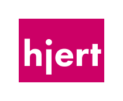

# skiftOS

# Components

## A simple, handmade, operating system for x86.
 

## A minimal kernel supporting multiprocessing and inter-process communication.

## A minimal colection of application.

# License
The skift operating and its core components are licensed under the **MIT License**.              
See: LICENSE.md