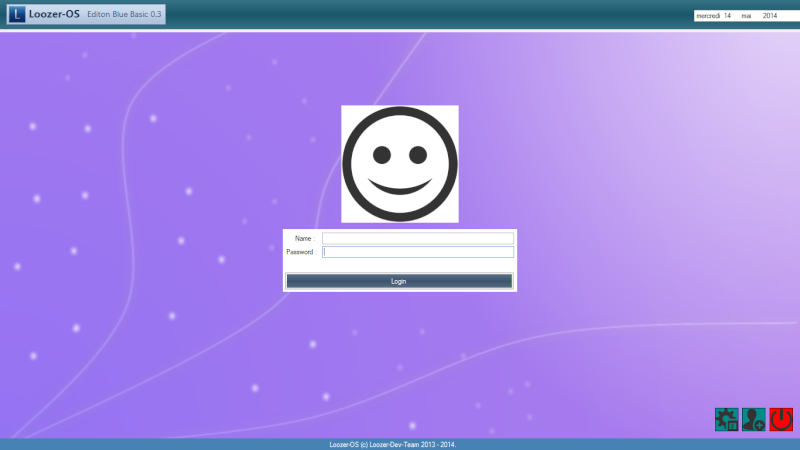
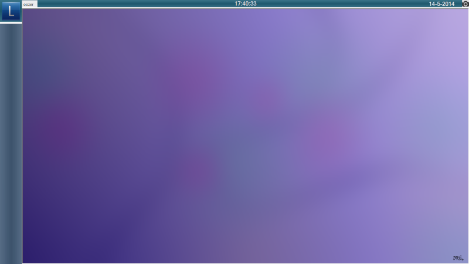
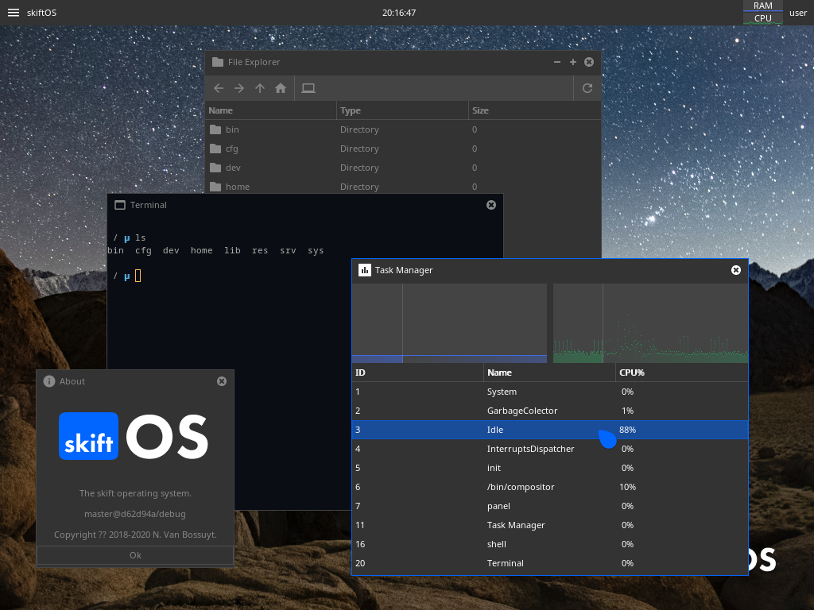
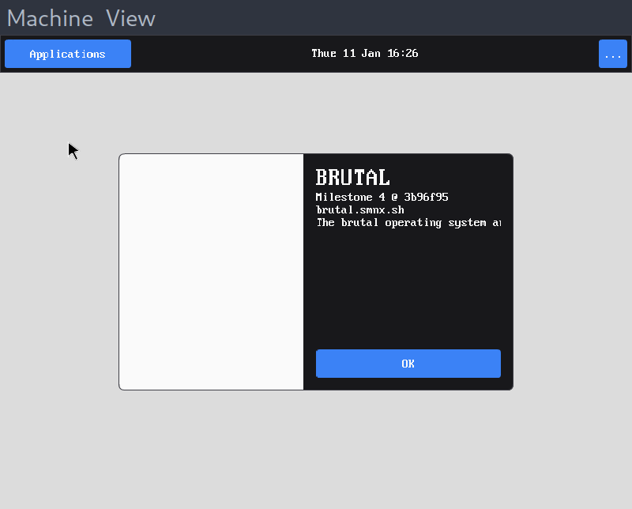
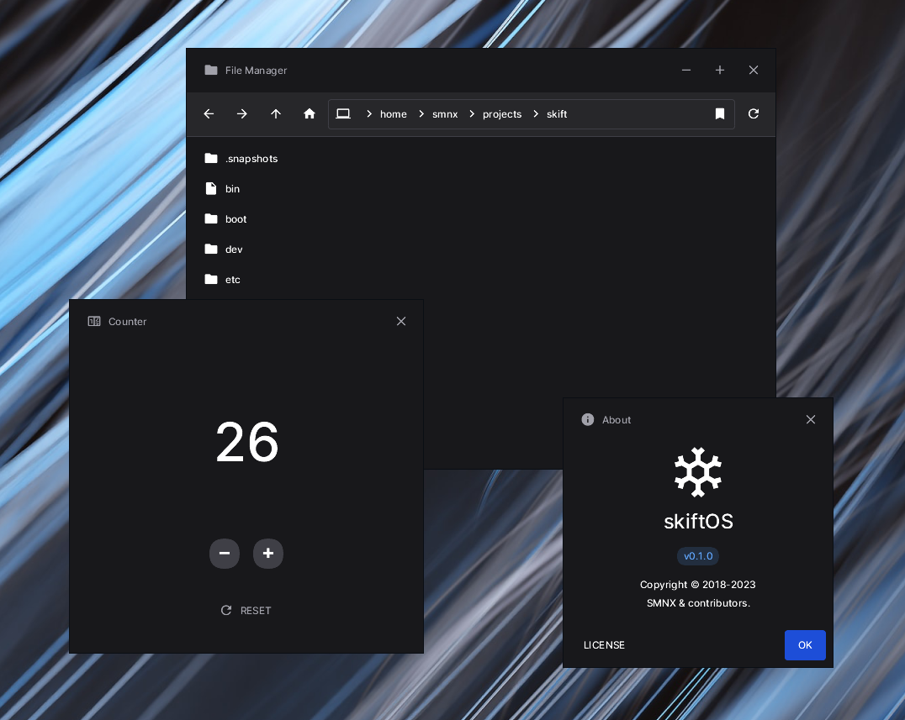
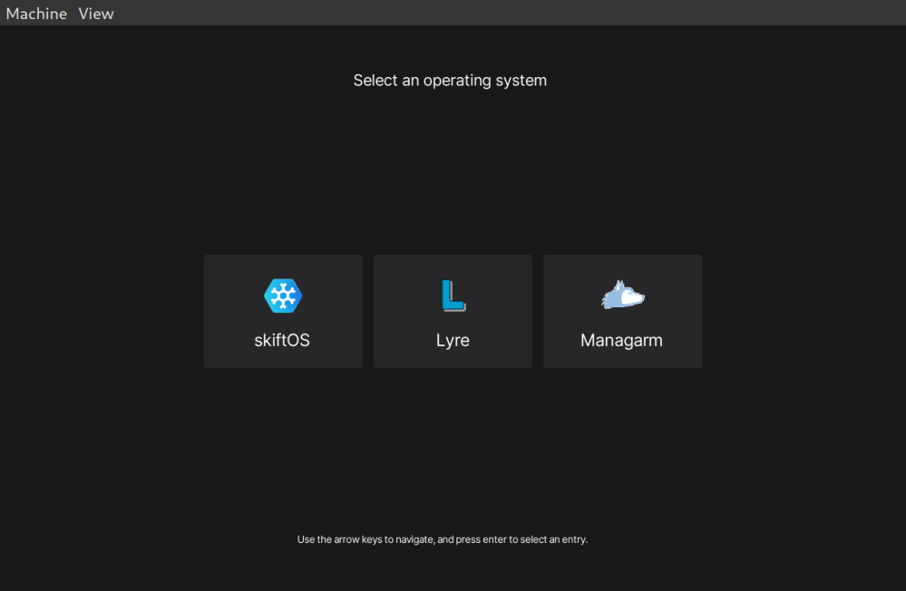
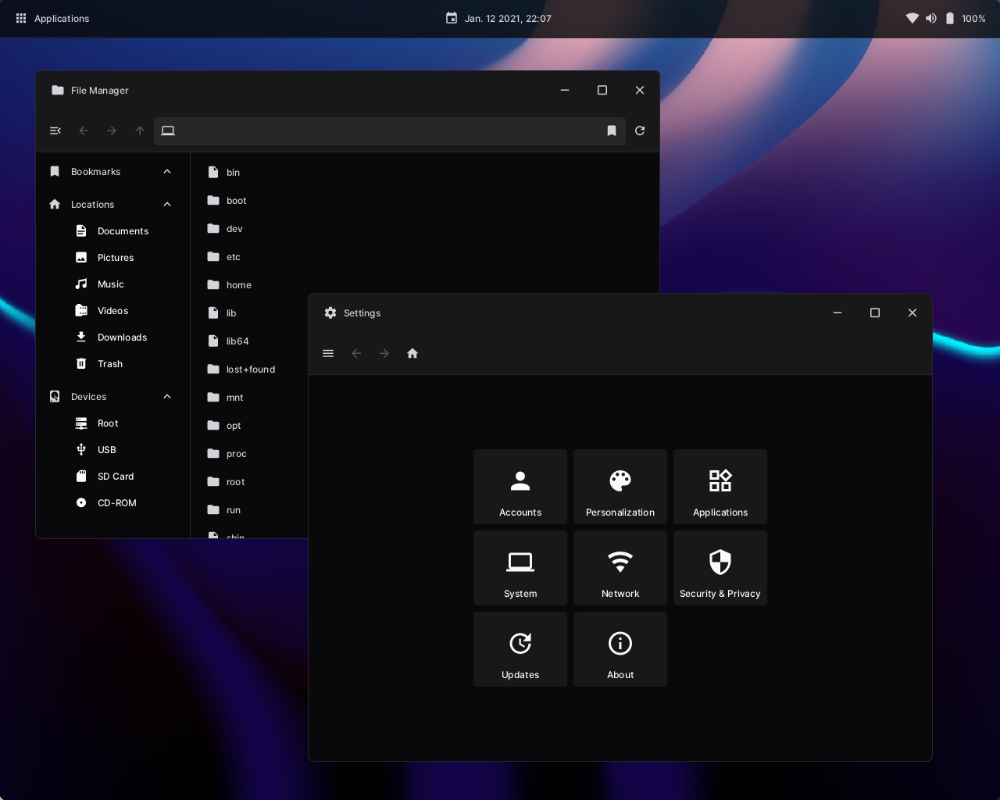

# History

> **🛈 Note** This document is a draft for a blog post. I plan to release it in early 2024 when the first version of skiftOS reaches 10 years old

In this short document, I will try to explain the history of the project. And my 10 years jurney as a operating system developer.

## 2014 - LoozerOS

The orginal name of the project was **LoozerOS**. It was a simple VB.NET application emulating the look and feel of an Operating System. It was a fun project to learn about programming and user interface design.

## 2015 - skiftOS

In 2015, the project was renamed to **skiftOS** because it was a better name.

## 2016 - 2017

During those years, the project was mostly on hold. I was busy with school and other projects. Such as my [Minicraft clone](https://github.com/sleepy-monax/hevadea)

Hevadea, a Minicraft clone

## 2019 - Baby steps

During a sleepless night, I decided to start working on skiftOS again. I started by writing a simple kernel in C and assembly.

## 2020 - Covid-19 and a lot of free time

In 2020, I had a lot of free time because of the Covid-19 pandemic. I decided to work on skiftOS again. I started by rewriting the kernel in C++ and adding a lot of features.

Better font rendering

Simple desktop environment and window manager

Simple terminal emulator, task manager and file manager

At the end of 2020, JT did a [presentation](https://www.youtube.com/watch?v=nMaLGPecwAg) about skiftOS at on her youtube channel [System with JT](https://www.youtube.com/@SystemsWithJT).

## 2021 - Hello Hacker News and the UNIX Utopia!

At the beginning of 2021, we started to get some traction on [Hacker News](https://news.ycombinator.com/item?id=25880558)

By the end of june of 2021, I was kind of burned out by the project and writing C++ in general. And started to work on a new project called [BRUTAL](https://brutal.smnx.sh/). Where skift was a monolithic kernel, BRUTAL is a microkernel. Where skift was written in C++, BRUTAL is written in C. It was tones of fun to work on BRUTAL with @supercip971. We learned a lot about operating system design, C and the x86_64 architecture.

BRUTAL running on QEMU

## 2022 - A new beginning

By july of 2022, I was missing working on skiftOS and Cyp wasn't available to work on BRUTAL. So I decided to start working on skiftOS again. I started the project from a clean slate. I choose the rewrite everything in modern C++20 and to use a microkernel architecture. The project started as a framework inspired by the rust standard library and user interface framework inspired by Iced and Compose. I also decided to use a capability-based security model.

By september, we had a MVP of the framework and the user interface library running on Linux.

## 2023 - New job and not much free time

In 2023, I started a new job and I didn't have much free time to work on skiftOS. I was mostly working on the framework and the user interface library. But I managed to build a working prototype of the microkernel, bootloader and the user interface shell.

By june, we had a working prototype of the microkernel, bootloader and the user interface shell.

## 2024 - The first release

I hope to release the first version of skiftOS in ~~2024~~ ~~2025~~ 2026

## Beyond

Thanks for reading this short history of the project. See [doc/roadmap](https://docs.skiftos.org/roadmap.html) for more information about the future of the project. I so excited to see where this project will go in the future. I hope you will join me in this journey (See [doc/contributing](https://docs.skiftos.org/contributing.html)). 😊
