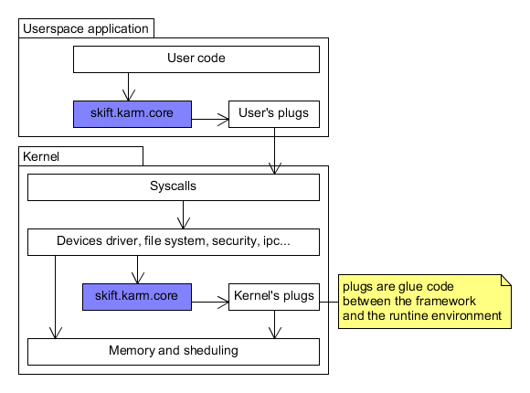

# skiftOS manual

- [skiftOS manual](#skiftos-manual)
  - [skift - The operating system](#skift---the-operating-system)
    - [Architecture overview](#architecture-overview)
  - [hjert - The kernel](#hjert---the-kernel)
  - [karm - The Framework](#karm---the-framework)
  - [core utils - Userspace tools](#core-utils---userspace-tools)
  - [hideo - The desktop environment](#hideo---the-desktop-environment)

## skift - The operating system

### Architecture overview

## hjert - The kernel

## karm - The Framework

## core utils - Userspace tools

## hideo - The desktop environment