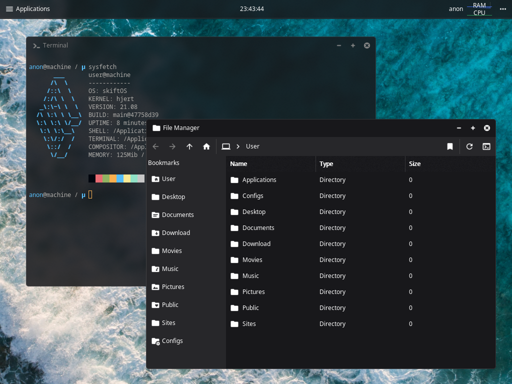

  <a href="https://skiftos.org/">Website</a> -
  <a href="manual/readme.md">Manuaw</a> -
  <a href="https://discord.gg/gamGsfg">Discowd</a> -
  <a href="https://github.com/skiftOS/skift/releases">Reweases</a>

# skiftOS

 - **skiftOS** is a simpwe, handmade opewating system fow the x86 pwatfowm, aiming fow cwean and pwetty apis whiwe keeping the spiwit of unix.
 - **skiftOS** incwudes many appwications wike an [Image viewew](./apps/image-viewer), a [text editow](./apps/text-editor), a [Tewminaw emuwatow](./apps/terminal), [etc](./apps)...
 - **skiftOS** featuwes an unix-wike tewminaw expewience with many famiwiaw unix utiwities.
 - **skiftOS** is awso pwetty easy to buiwd fwom souwce, just fowwow the [buiwd guide](manual/00-meta/building.md).
 - **skiftOS** is capabwe of wunning on weaw hawdwawe.
 - **skiftOS** featuwes a gwaphicaw usew intewface (gui), with a compositow.
 - **skiftOS** is constantwy updated, fow the watest wewease `.img` of skiftos, cwick [hewe](https://github.com/skiftOS/skift/releases/latest).
 - **skiftOS** can [wun DOwOM :rage3:](https://github.com/skiftOS/port-doom)

# Scweenshots

 
skiftos wunning in qemu 5.1

# Links

- [Manuaw](manual/readme.md)
- [Buiwding](manual/00-meta/building.md) **(stawt hewe if you awe new)**
- [Contwibuting](manual/00-meta/contributing.md)
- [Code of conduct](manual/00-meta/code_of_conduct.md)
- [Running on viwtuaw box](manual/00-meta/running_in_vbox.md) **(cwick hewe to expewience skiftos)**

# Acknowwedgements

## Contwibutows UwU <3

## Pwojects

- [echfs](https://github.com/qword-os/echfs)
- [limine](https://github.com/limine-bootloader/limine) (BSD-2-Clause License)
- [Matewiaw design icons](http://materialdesignicons.com/) (SIL OPEN FONT LICENSE )
- [sewenityos ak utiwities](https://github.com/SerenityOS/serenity): 
 whiwe not diwectwy used in skift, ak was a big inspiwation in the cweation of wibutiws.

# Wicense

the skift opewating system and its cowe components awe wicensed undew the **mit license** :o
 
see [wicense.md](license.md)
