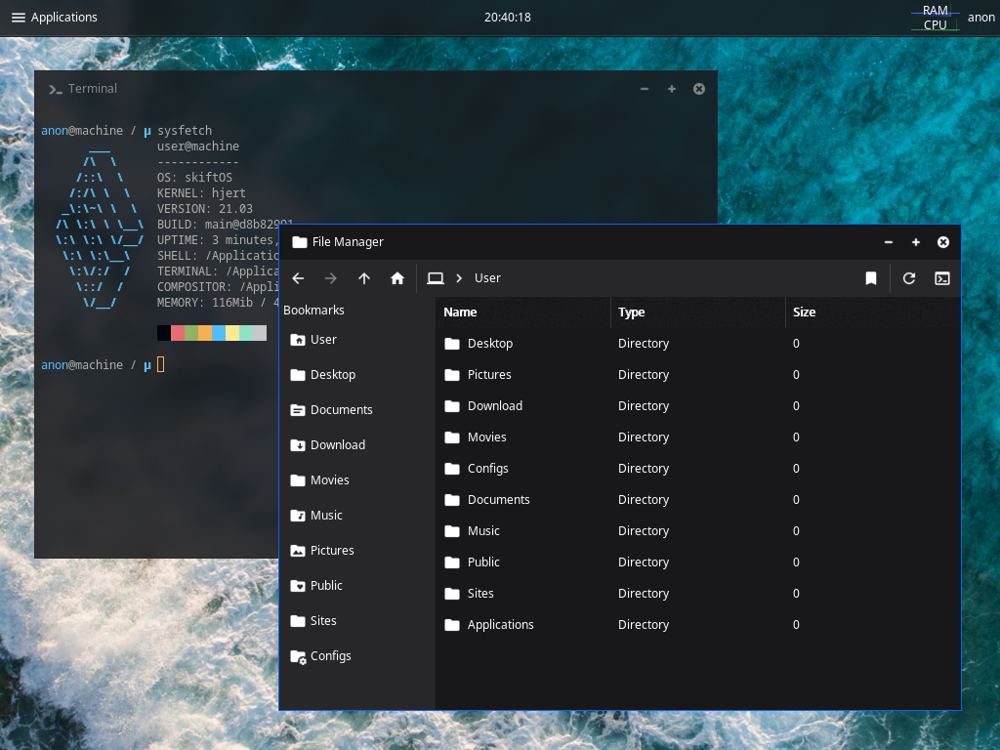

  <a href="https://discord.gg/gamGsfg">Discord</a> -
  <a href="https://skiftos.org/">Website</a> -
  <a href="https://github.com/skiftOS/skift/releases">Releases</a> -
  <a href="manual/readme.md">Manual</a>

# skiftOS

 - **skiftOS** is a simple, handmade operating system for the x86 platform, aiming for clean and pretty APIs while keeping the spirit of UNIX.
 - **skiftOS** features an UNIX-like terminal experience with many familiar UNIX utilities.
 - **skiftOS** is constantly updated, for the latest release `.img` of skiftOS, click [here](https://github.com/skiftOS/skift/releases/latest).
 - **skiftOS** is also pretty easy to build from source, just follow the [build guide](./manual/building.md).
 - **skiftOS** can function as a virtual machine, click [here](./manual/running_vm.md) to set up an instance on Virtual Box.
 - **skiftOS** is capable of running on real hardware.
 - **skiftOS** is a labor of love.
 - **skiftOS** features a graphical user interface (GUI), with a compositor.
 - **skiftOS** includes many applications like an [Image Viewer](./apps/image-viewer), a [Text Editor](./apps/text-editor), a [Terminal Emulator](./apps/terminal), [etc](./apps)...
 - **skiftOS** can [run DOOM :rage3:](https://github.com/skiftOS/port-doom)

# Screenshots

 
skiftOS running in QEMU 5.1

# Links

- [Manual](manual/readme.md)
- [Building](manual/building.md) **(start here if you are new)**
- [Contributing](manual/contributing.md)
- [Code of conduct](manual/code_of_conduct.md)
- [Running on Virtual Box](manual/running_vm.md) **(click here to experience skiftOS)**

# Acknowledgements

## Contributors

## Projects

- [echfs](https://github.com/qword-os/echfs)
- [limine](https://github.com/limine-bootloader/limine) (BSD-2-Clause License)
- [lodepng](https://github.com/lvandeve/lodepng) (zlib License)
- [Material Design Icons](http://materialdesignicons.com/) (SIL OPEN FONT LICENSE )
- [std_truetype](https://github.com/nothings/stb) (MIT/Public Domain)
- [serenityOS AK utilities](https://github.com/SerenityOS/serenity): 
  while not directly used in skift, AK was a big inspiration in the creation of libutils.

# License

The skift operating system and its core components are licensed under the **MIT License**.

See [license.md](license.md)
