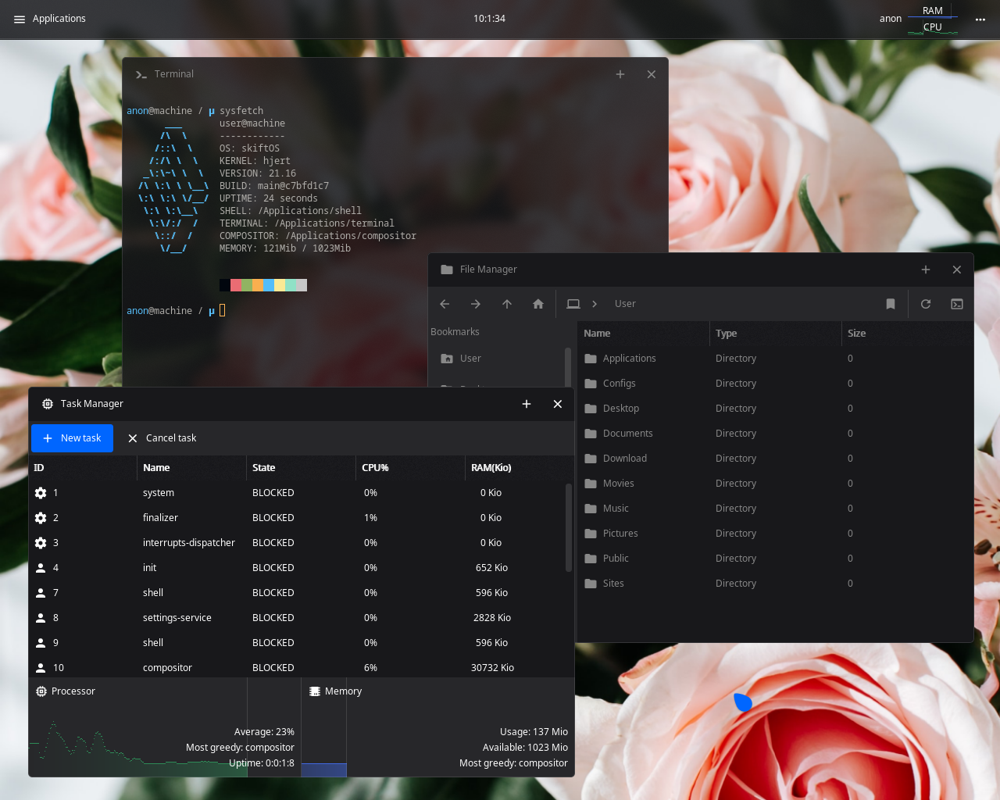

  <a href="https://skiftos.org/">Website</a> -
  <a href="manual/readme.md">Manual</a> -
  <a href="http://discord.skiftos.org">Discord</a> -
  <a href="https://github.com/skiftOS/skift/releases">Releases</a>

# skiftOS

 - **skiftOS** is an operating system built from scratch in modern C++. 
 - **skiftOS** is featuring a reactive UI library and has a strong emphasis on user experience. 
 - **skiftOS** exposes its features to developers through clean APIs.
 - **skiftOS** includes many applications like an [Image Viewer](./userspace/apps/image-viewer), a [Text Editor](./userspace/apps/text-editor), a [Terminal Emulator](./userspace/apps/terminal), [etc](./userspace/apps)...
 - **skiftOS** features an UNIX-like terminal experience with many familiar UNIX utilities.
 - **skiftOS** is also pretty easy to build from source, just follow the [build guide](manual/meta/building.md).
 - **skiftOS** is capable of running on real hardware.

# Screenshots

 
skiftOS running in QEMU 5.1

# Links

- [Manual](manual/readme.md)
- [Building](manual/meta/building.md) **(start here if you are new)**
- [Contributing](manual/meta/contributing.md)
- [Code of conduct](manual/meta/code_of_conduct.md)
- [Running on Virtual Box](manual/meta/running_in_vbox.md) **(click here to experience skiftOS)**

# Acknowledgements

## Contributors

## Projects

- [echfs](https://github.com/qword-os/echfs)
- [limine](https://github.com/limine-bootloader/limine) (BSD-2-Clause License)
- [Material Design Icons](http://materialdesignicons.com/) (SIL OPEN FONT LICENSE )
- [serenityOS AK utilities](https://github.com/SerenityOS/serenity):  while not directly used in skift, AK was a big inspiration in the creation of libutils.

# License

The skift operating system and its core components are licensed under the **MIT License**.

The full text of the license can be accessed via [this link](https://opensource.org/licenses/MIT) and is also included in the [license.md](license.md) file of this software package.
