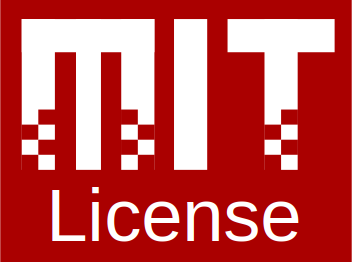

<br/>
<br/>
<br/>
<br/>

<p align="center">
  
  
</p>

<br/>

<p align="center">
  <a href="https://skift.smnx.sh/">Website</a> -
  <a href="https://discord.com/invite/gamGsfg">Discord</a> -
  <a href="https://github.com/skift-org/skift/releases">Releases</a>
</p>

<br/>
<br/>
<br/>


## About

> [!WARNING]
> skiftOS is currently in the early stages of development and is not yet ready for daily use. Please do not use it in production environments. Here be dragons! 🐉

**skiftOS** is a hobby operating system built from scratch for ARM, x86, and RISC-V architectures. It is designed to be simple, modern, and modular, featuring a modern C++ core library, reactive UI, and a capability-based microkernel. skiftOS values simplicity, modernity, and modularity, and has several notable features such as multi-architecture support and easy hackability. It is free and open-source under the MIT license.


## Building

> [!NOTE]
> If you are having trouble building skiftOS, feel free to ask for help in the [Discord server](https://discord.com/invite/gamGsfg)

To build skiftOS, you need to have a modern C/C++ compiler such as clang-16 installed on your computer. Additionally, you need to have the following tools installed: `python3`, `llvm`, `clang`, `ninja`, `nasm`, and `qemu`. Please refer to the documentation of these tools or use your package manager to install them.

### Step 1: Set up the build environment

First, set up the build environment by running the following command:

```sh
$ ./skift.sh setup
```

Then, check that everything is working correctly by running:

```sh
$ ./skift.sh doctor
```

### Step 2: Download third-party dependencies

After setting up the build environment, download the third-party dependencies by running the following command:

```sh
$ ./skift.sh install
```

### Step 3: Build and run skiftOS

Finally, build and run skiftOS by running the following command:

```sh
$ ./skift.sh start
```

If all these steps are completed successfully, you should have a fully built and operational skiftOS ready for use. Enjoy! 😊

## Contributing

Contributions are welcome and encouraged for this project! We practice [optimistic merging](http://hintjens.com/blog:106), which means that pull requests are merged into the main branch as soon as possible. The goal is to keep pull requests small, focused, and incremental.

When writing commit messages, please keep them short and concise. They should be prefixed with the name of the package that the commit affects. For example:

```
karm-base: Fix buffer overflow in Karm::String::reserve.
```

Binary files should be kept as small as possible. Here are some tips for reducing the size of different image formats:
- Use SVG instead of other raster image formats whenever possible.
- Use `optipng -strip all` to reduce the size of PNG images.
- Use `gifsicle -O3` to reduce the size of GIF images.
- Use `jpegoptim -m90` to reduce the size of JPEG images.

## Acknowledgements

I, Sleepy-monax, would like to express my gratitude to the following individuals for their help and support:

- Cyp, Keyboard Slayer, and D0p1 for being great friends and providing me with support and motivation.
- Feliwir for his contributions to the skiftOS and BRUTAL projects. I learned a lot from Feliwir's work and am grateful for his help.
- All the people who have contributed to the project and supported me through Github Sponsors.

## License

<a href="https://opensource.org/licenses/MIT">
  
</a>

The skift operating system and its core components are licensed under the **MIT License**.

The full text of the license can be accessed via [this link](https://opensource.org/licenses/MIT) and is also included in the [license.md](license.md) file of this software package.
