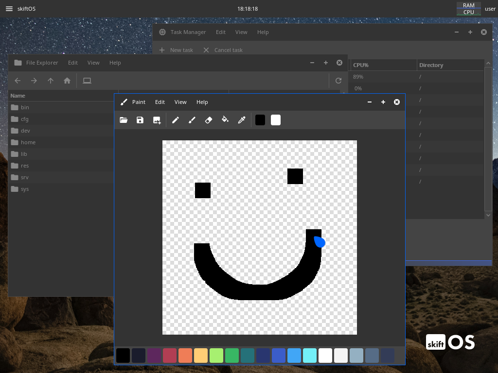
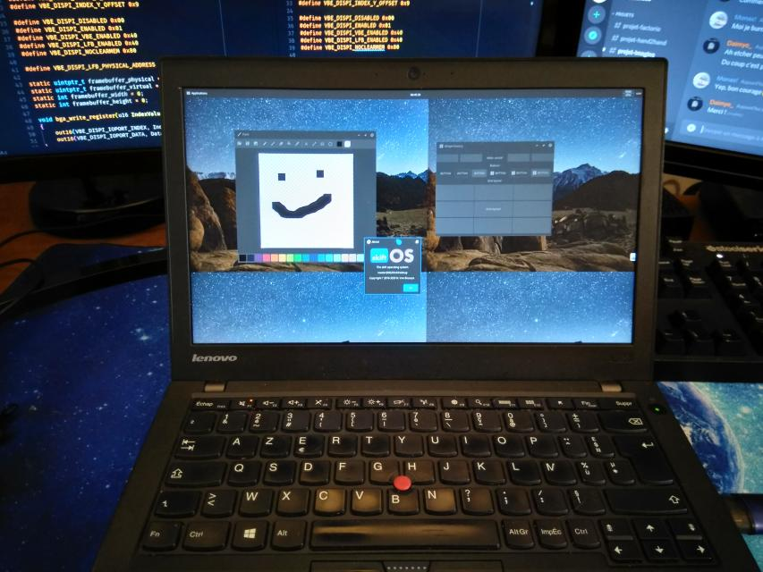

<a href="https://discord.gg/gamGsfg">Discord</a> -
<a href="https://skiftOS.github.io/">Website</a> -
<a href="https://github.com/skiftOS/skift/releases">Releases</a> -
<a href="manual/readme.md">Manual</a>

<b>Notice!</b> We've moved the project to C++ recently, so don't expect it to be idiomatic yet. There is still a lot of work to be done, and any help is very appreciated :)

# skiftOS

 - **skiftOS** is a simple, handmade, operating system for the x86 platform. Aiming for clean and pretty API while keeping the spirit of UNIX.
 - **skiftOS** is pretty easy to build from source, just follow the [build guide](manual/building.md)
 - **skiftOS is a student project, don't expect it to be secure or stable at this stage.**

# Screenshots

skiftOS running in QEMU

 

Running on real hardware (Thinkpad x250)

# Features

 - Pre-emptive multitasking
 - I/O redirection
 - IPC sockets
 - Low level utility and system library (libsystem)
 - 2D and 3D graphic library (libgraphic)
 - PNG support through lodepng
 - Graphical user interface library (libwidget)
 - A compositing window manager (Compositor)
 - A terminal emulator which support unicode and vt100 escape sequence (Terminal)
 - [It can run DOOM :rage3:](https://github.com/skiftOS/port-doom)

# License

The skift operating system and its core components are licensed under the **MIT License**.

See: [LICENSE.md](./license.md)
