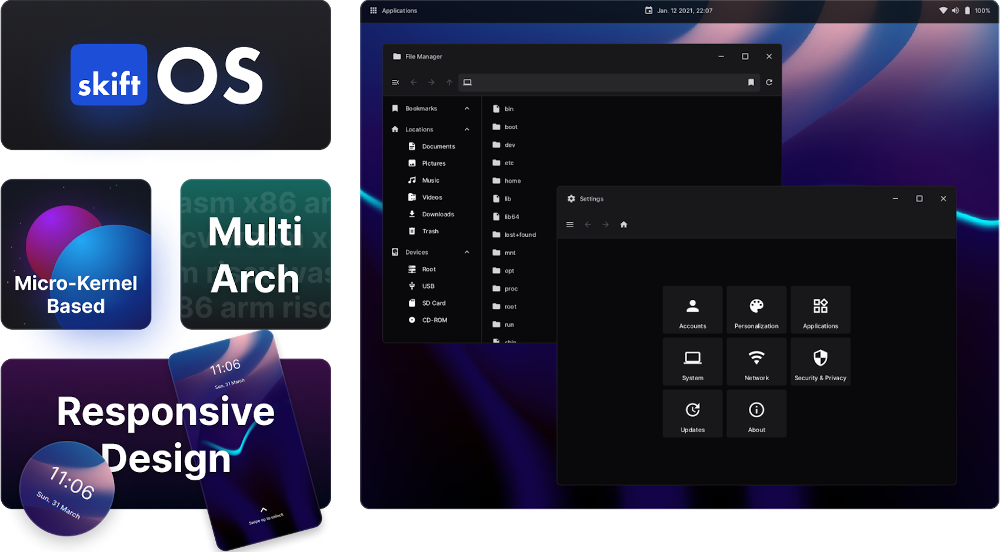

## About

 -
<a href="https://skiftos.org/">Website</a> -
<a href="https://discord.com/invite/gamGsfg">Discord</a> -
<a href="https://docs.skiftos.org">Documentation</a>

> **⚠ Warning**  skiftOS is currently in the early stages of development and is not yet ready for daily use. Please do not use it in production environments. Here be dragons! 🐉

**SkiftOS** is a hobbyist operating system built from the ground up with a focus on modularity, simplicity, and modern design principles.  Driven by a dissatisfaction with the fragmented user experiences prevalent in contemporary operating systems, SkiftOS strives for deep integration and a cohesive aesthetic. This project is a labor of love—an artistic pursuit rather than a commercial product.

## Key Features

- **Karm**: A modern C++ core library providing foundational building blocks.
- **KarmUI**: A reactive UI framework for building elegant user interfaces.
- **Hideo**: A beautiful desktop environment prioritizing intuitive design.
- **Hjert**: A capability-based "pragmatic" microkernel.
- **CuteKit**: A versatile build system and package manager designed for cross-compilation and complex project management.
- **Vaev**: A browser engine built for speed, accuracy, and simplicity.

## Core Philosophy

- **Modularity**: Components are designed to be as self-contained as possible, encouraging customization and experimentation.
- **Simplicity**: Skift favors clear solutions over complexity, aiming for a system that is understandable and maintainable.
- **Modernity**: Skift leverages cutting-edge C++ practices and technologies for safety, readability, and efficiency.

## Target Audience

SkiftOS is intended for developers and those interested in the exploration of niche, hobby operating systems.

## Building

Building skiftOS from source is easy.

See [doc/building](https://docs.skiftos.org/building.html)

## Contributing

Contributions are welcome!

See [doc/contributing](https://docs.skiftos.org/contributing.html)

## Acknowledgements

I, Sleepy-monax, would like to express my gratitude to the following individuals for their help and support:

- Cyp, Keyboard Slayer, and D0p1 for being great friends and providing me with support and motivation.
- Feliwir for his contributions to the skiftOS and BRUTAL projects. I learned a lot from Feliwir's work and am grateful for his help.
- All the people who have contributed to the project and supported me through Github Sponsors.

## License

The skift operating system and its core components are licensed under the **GNU Lesser General Public License v3.0 or later**.

The full text of the license can be accessed via [this link](https://www.gnu.org/licenses/lgpl-3.0-standalone.html) and is also included in the [license.txt](license.txt) file of this software package.
