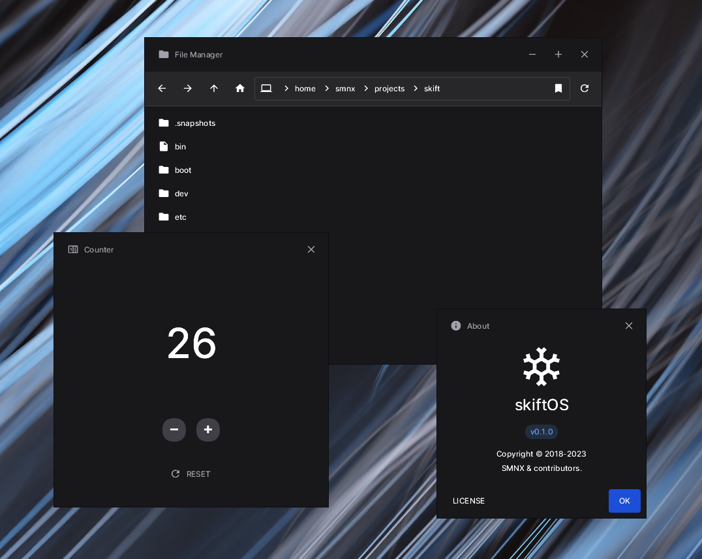

<br/>
<br/>
<br/>
<br/>
<br/>

<p align="center">
  
  
</p>

<p align="center">
  <a href="https://skiftos.org/">Website</a> -
  <a href="http://discord.skiftos.org">Discord</a> -
  <a href="https://github.com/skiftOS/skift/releases">Releases</a>
</p>

<br/>
<br/>
<br/>
<br/>
<br/>

# **skiftOS**: The delightful operating system

[](https://github.com/skift-org/skift/actions/workflows/build.yml)
[](https://opensource.org/licenses/MIT)
[](http://discord.skiftos.org)

# Table of Contents

- [**skiftOS**: The delightful operating system](#skiftos-the-delightful-operating-system)
- [Table of Contents](#table-of-contents)
- [Introduction](#introduction)
  - [Values](#values)
  - [Features](#features)
  - [Screenshot](#screenshot)
- [Getting Started](#getting-started)
  - [Building](#building)
  - [Contributing](#contributing)
- [Acknowledgements](#acknowledgements)
  - [Contributors](#contributors)
  - [Projects](#projects)
- [License](#license)

# Introduction

**skiftOS** is a hobby operating system built from scratch using contemporary C and C++ for ARM, x86, and RISC-V architectures. It is designed to be simple, modern, modular, open, and inclusive. skiftOS features a modern C++ core library, modern reactive UI, and a capability-based microkernel for security and modularity.

## Values

As a hobby operating system, skiftOS is built with the following values in mind:

- **Simple**: skiftOS aims to be simple and easy to use, without being overly complex or difficult to understand. It prioritizes user-friendliness over feature bloat.

- **Modern**: skiftOS is built using modern C++ and C standards, and is designed to be extensible and hackable. It leverages modern programming techniques and technologies to provide a robust and efficient operating system.

- **Modular**: skiftOS is designed to be modular and extensible. It is built around a microkernel architecture, which allows for the addition of new features without having to modify the core components of the operating system.

- **Open**: skiftOS is an open-source project and is licensed under the MIT license. This means that anyone can use, modify, and redistribute the code without any restrictions.

- **Inclusive**: skiftOS is built by a diverse group of people from all around the world. It is designed to be inclusive and welcoming to everyone, regardless of their background or experience level. The project encourages contributions from all members of the community.

## Features

skiftOS has several notable features:

- **Modern C++ Core Library**: skiftOS is built using karm, a modern C++ core library that provides essential functionality like memory management, file I/O, and networking. karm takes inspiration from Rust and C++ to create a powerful and efficient library.

- **Modern Reactive UI**: skiftOS uses karm-ui, a modern reactive UI library that is based on unidirectional data flow. It takes inspiration from popular UI frameworks like React and Flutter, and enables developers to create powerful and responsive user interfaces.

- **Capability-based Microkernel**: skiftOS is built around a microkernel architecture that uses capability-based security. This means that each process has only the permissions it needs to perform its tasks, which makes the operating system more secure and easier to maintain.

- **Multi-architecture Support**: skiftOS can run on multiple architectures, including ARM, x86, and RISC-V. This makes it highly versatile and allows it to run on a variety of devices.

- **Easy to Hack On**: skiftOS is designed to be easy to hack on, with a focus on simplicity and modularity. This means that developers can easily contribute to the project and add new features without having to understand the entire codebase.

- **Free and Open-Source**: skiftOS is licensed under the MIT license and is free to use, modify, and redistribute. This makes it accessible to everyone and encourages collaboration and innovation.

## Screenshot

<p align="center">

<br>
skiftOS applications running on Linux
</p>

# Getting Started

## Building

skiftOS is written in bleeding-edge C23 and C++23 and building it requires a modern C/C++ compiler like clang-14 or GCC-12 installed on the host machine.

```sh
# Make sure clang is the right version
$ clang --version
clang version 13.0.1
Target: x86_64-pc-linux-gnu
Thread model: posix
InstalledDir: /usr/bin

# Make sure nasm is installed
$ nasm --version
NASM version 2.15.05 compiled on Sep 24 2020

# Make sure python3 is installed
$ python3 --version
Python 3.10.5
```

Building skiftOS also requires installing [CuteKit](https://github.com/cute-enginnering/cutekit)

> CuteKit is a package manager and build system for C/C++/ASM/RUST projects. It is designed to meet the needs of hobby operating systems and other low-level projects.

```sh
$ git clone https://github.com/cute-enginnering/cutekit

$ cd cutekit

$ pip install --user -e .
```

Once you have installed CuteKit, you can install the dependencies and build the operating system:

```sh
$ ck install

$ ck build --all
```

Finally, you can run the operating system using:

```sh
$ ck start
```

> After pulling new changes, you can run `ck clean` to remove the build artifacts and `ck build --all` to rebuild the operating system.

Individual components can be run on the host system using:

```sh
$ ck run <component>
```

> Use `ck help` to get more information about the available commands.

## Contributing

Contributions are welcome and encouraged!

This project practice [optimistic merging](http://hintjens.com/blog:106) meaning that pull requests are merged into the main branch as soon as possible. The objective is to keep PR as small, focused, and incremental as possible.

Commit messages should be short and concise and prefixed with the name of the package. For example:

```

karm-base: Fix buffer overflow in Karm::String::reserve.

```

Binary files should be as small as possible.

- SVG should be preferred over other raster images formats
- `optipng -strip all` to reduce the size of PNG images.
- `gifsicle -O3` to reduce the size of GIF images.
- `jpegoptim -m90` to reduce the size of JPEG images.

# Acknowledgements

I (sleepy-monax) would like to thank the following people for their help and support:
 - [Cyp](https://cyp.sh), [Keyboard Slayer](https://github.com/keyboard-slayer), and [D0p1](https://github.com/d0p1s4m4) for being great friends giving me a lot of support and motivation.
 - [Feliwir](https://github.com/feliwir) for all the work he did on the past skiftOS and BRUTAL project. I learned a lot from his work and I am very grateful for his help.
 - And all the people who have contributed to the project and send me money on [Github Sponsors](https://github.com/sponsors/sleepy-monax)

## Contributors

<a href="https://github.com/skiftOS/skift/graphs/contributors">
  
</a>

## Projects

- [The OSDev Wiki](https://wiki.osdev.org/Main_Page)
- [The DEVSE Community](https://devse.wiki)
- [The Limine Project](https://limine-bootloader.org/)
- [The BRUTAL Project](https://brutal.smnx.sh)
- [The SerenityOS Project](https://serenityos.org/)

# License

<a href="https://opensource.org/licenses/MIT">
  
</a>

The skift operating system and its core components are licensed under the **MIT License**.

The full text of the license can be accessed via [this link](https://opensource.org/licenses/MIT) and is also included in the [license.md](license.md) file of this software package.

<br>
<br>
<br>
<br>
<p align="center">
  
</p>
<br>
<br>
<br>
<br>
