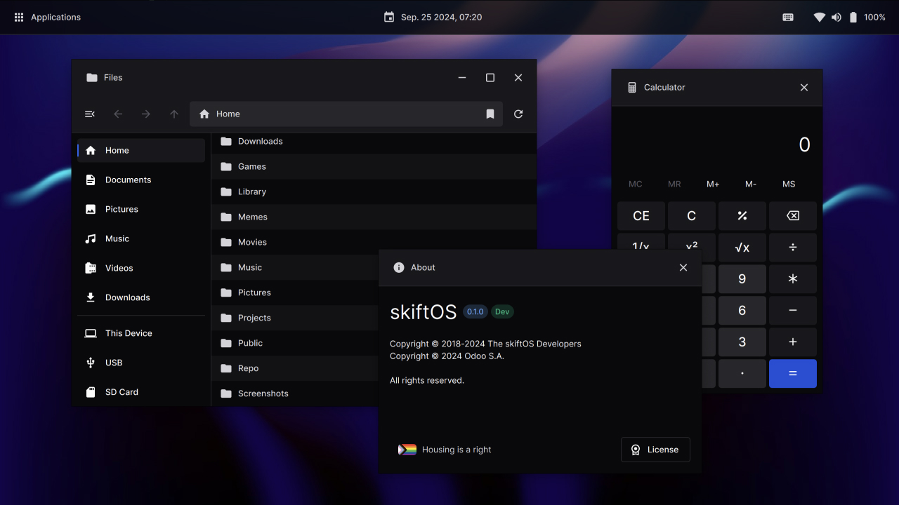

 
 

    

    A modern desktop environment for Skift & Linux

 
 

 
 

## License

The hideo desktop environment is licensed under the **GNU Lesser General Public License v3.0 or later**.

The full text of the license can be accessed via [this link](https://www.gnu.org/licenses/lgpl-3.0-standalone.html) and is also included in the [license.txt](license.txt) file of this software package.
