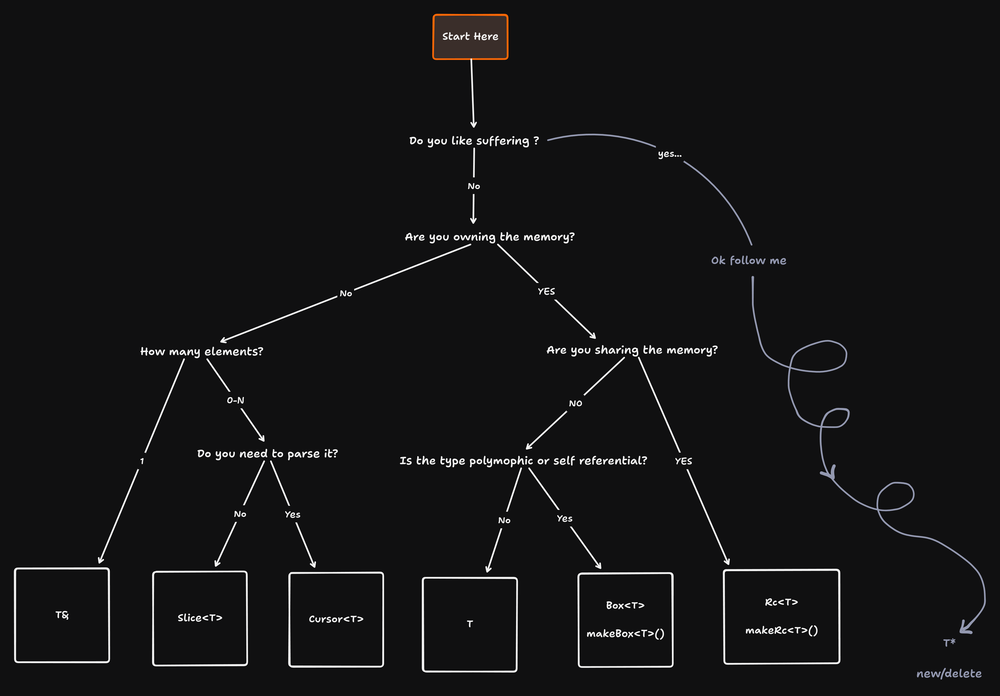

# Karm'ism

Everything here is built on top of Karm, a modern C++ framework that makes the language safer and easier. This document will guide you in using the library to its fullest potential 💪😤

## Choosing a reference type

We avoid using raw pointers at all costs. The following decision tree should help you find a suitable alternative for your use case.

**Legend**

- `T&` - [Basic C++ reference type](https://en.cppreference.com/w/cpp/language/reference). Provides a way to refer to an existing object without taking ownership.
- `Slice<T>` - Represents a view over a contiguous sequence of elements (e.g., arrays or vectors). It does not own the elements but allows safe, bounds-checked access.
- `Cursor<T>` - A pointer-like structure for iterating through elements with additional context or state information (e.g., current position in a stream).
- `T` - The base type. Ownership and reference semantics are determined by the context in which it is used (e.g., passed by value or reference).
- `Box<T>` - An owning smart pointer type that manages heap-allocated objects. Ensures single ownership and automatic deallocation when no longer needed.
- `Rc<T>` - A type that enforces ownership semantics and resource safety, often used for unique, non-copyable resources. Provides strong exception safety guarantees.
- `T*` - Raw pointer. Gateway to hell, don't use it unless you have a ***really*** good reason. (Hint: you don't)
