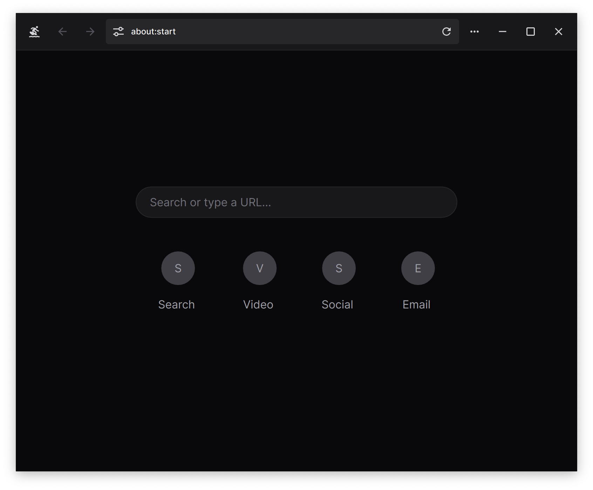

 
 
 

    

    A lightning-fast, lightweight, and secure HTML/CSS engine
built for effortless document generation and streamlined web browsing.

 

 
 

## Supported Standards

Veav aims to support the following standards:

- [CSS Snapshot 2023](https://www.w3.org/TR/CSS)
- [HTML Living Standard](https://html.spec.whatwg.org/multipage/)
- [SVG 2](https://www.w3.org/TR/SVG2/)
- [MathML 3](https://www.w3.org/TR/MathML3/)
- [XML 1.0](https://www.w3.org/TR/REC-xml/)

## Architecture

An [architecture diagram](diagrams.tldr) is available next to this file. It's in the tldraw format.

